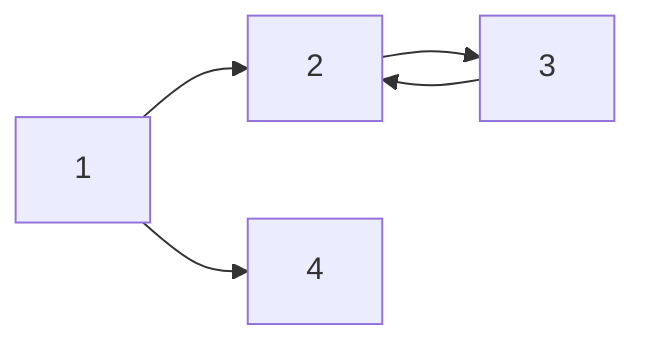

###### 태그와 관련된 Markdown


<br>
\#은 Header 를 의미합니다.  

\#의 갯수에 따라서 Header의 H1, H2 등을 구분할 수 있습니다.  
# H1 태그  

## H2 태그  

### H3 태그  

#### H4 태그  

##### H5 태그  

###### H6 태그  

`보통 태그를 2~3개만 사용하며, 사용자에 따라서는 H1 은 타이틀로 넘기고 H2 부터 사용하는 경우도 있습니다.`  
`태그를 H5까지 사용하게 된다면 분류를 다시 한번 고려해보는 것도 좋아요.`   

`H7 태그는 없어요.`  

<br>
<br>
`---를 글 밑에 사용하면 위의 글을 H2태그 크기로 만들어줘요.`  

ex) 이렇게요.  
---


<br>
<br>
`===를 글 밑에 사용하면 위의 글을 H1태그 크기로 만들어줘요.`    

ex) 이렇게요.  
===

---

\---를 단독으로 사용하면 글 내에 줄을 만들어줍니다.  

---
###### 글과 관련된 Markdown 들  

_italic_  
*italic*  
\_원하는 내용_ 을 통해서 기울임체를 사용할 수 있어요.  
\*원하는 내용* 을 통해서도 기울임체를 사용할 수 있어요.  

<br/>
**bold**  
\*\*원하는 내용** 을 통해서 강조를 보여줄 수도 있어요.  

<br/>
**_italic+bold_**  
\*\*\_원하는 내용_** 을 통해서 기울이고 강조를 할 수도 있어요.  

<br/>
~~hello~~  
\~~원하는 내용~~ 을 통해서 줄을 그을수도 있어요.  
*단 정식문법이 아니라서, 되는 곳도 있고 안 되는 곳도 있어요.  

<br/>
> 이건 Quote에요.  
\> 꺽쇠를 사용해서 인용문(Quote)을 사용할 수 있어요.  
Quote 안에서 bold, italic 등 다 사용할 수 있어요.  

---
###### 정렬 (list)와 관련된 Markdown
<br/>
순서 없는 리스트 (Unordered List)  
* list 1
* list 2
* list 3
    - A
    - B
        - C
        - D

`* 원하는내용 을 사용하면 순서가 없는 리스트 (Unordered List)를 사용할 수 있어요.`
`* 뒤에 항상 한칸 띄우고 원하는 내용을 적어야해요.`

리스트 밑에 탭으로 공간을 띄운 후 \- 를 사용하면 A와 같이 사용할 수 있어요.  
리스트 밑에 더블 탭으로 공간을 띄운 후 \- 를 사용하면 B와 같이 사용할 수 있어요.  
<br/>

순서 있는 리스트 (List)  

1. list 1
2. list 2
3. list 3
    1. A
    1. B
        1. C
        1. D


`1. 원하는내용 을 사용하면 순서 있는 리스트(List)를 사용할 수 있어요.`  
`1. 뒤에 항상 한칸 띄우고 원하는 내용을 적어야해요.`  

<br/>

표 사용법  
|컬럼명|description|비고|
|----|-----------|---|
|안녕|1|2|
|할로|3|4|

`\(back slash)를 쉬프트해서 표현하는 | (vertical bar)를 사용해요.` 
`\이 없다면 ₩를 쉬프트해서 사용해보세요.`  
<br/>
\|컬럼명|description|비고|  
\|------|-------------|-----|  
\|안녕|1|2|  
\|할로|3|4|  
이렇게 사용할 수 있어요.  
`* -의 갯수를 양식에 맞춰주는 IDE extension 도 있다고 해요.` 

---

###### 링크와 이미지

링크  

[링크이름](naver.com)  
\[링크이름](naver.com) 으로 사용하면 되요.  
HTML 문법인 \<a href="naver.com">링크이름\</a> 와 동일해요.  

<br/>
<br/>

이미지  


\으로 사용하면 되요.  
\[ ] 안에 들어가는 내용은 이미지 불러오기를 실패했거나, 이미지를 컴퓨터가 읽어줄 때(universal design) 사용할 글이에요. HTML에서 사용되는 alt와 같은 의미에요.  
<spam/>

이렇게요.
<spam/>
\은 항상 width 100, 중앙정렬로 맞춰져요.
크기가 마음에 안들거나, 새로운 옵션을 주고 싶다면  

`\`
`\ `
를 사용하면 돼요.  


---
###### 코드

`simple code`  
코드 한 줄은 \`원하는 내용`을 쓰면 돼요.  
<br/>

```c
#include <stdio.h>

int main (){
    printf("Hello, universe");
    return (0);
};
```
긴 줄 코드는 
\```언어
코드 내용
\```

으로 덮으면 돼요. 언어에는 c, cpp, sh 등 표시할 언어를 적으면 돼요.  

\* 문법에 사용되는 \*\-\` 등을 화면에 그대로 보여주고 싶다면 해당 특수기호 앞에 \\백슬래시를 쓰면 돼요. 백슬래시는 \\를 두번 사용하면 돼요.   

---

###### 수식  

수식은 \$원하는 수식\$을 사용하면 돼요.  

$a+b = c$

$a^2 + b^2 = c^2$
<br/>

수식을 가운데로 넣고 싶다면 \$$ 원하는 수식 \$$ 을 사용하면 돼요.  

$$(\alpha + \beta)^2 \alpha^2 + 2 \alpha \beta + \beta^2$$

\*^을 통해 제곱을 표현할 수 있어요.
*\alpha, \beta 를 통해 알파, 베타를 표현할 수 있어요.

---

###### 다이어그램 그리기



```
graph LR
    1-->2
    1-->4
    2-->3
    3-->2
```
처럼 코드로 감싼 후, 언어를 mermaid 를 사용하면 돼요.

---


출처

>[토크ON세미나] Git & HGitHub Page 블로그 만들기 4강 - Github Page 활용하기 | T아카데미 [링크](https://www.youtube.com/watch?v=eCv_bh-Ax-Q)
>[공통]마크다운 markdown 작성법 [링크](https://gist.github.com/ihoneymon/652be052a0727ad59601)